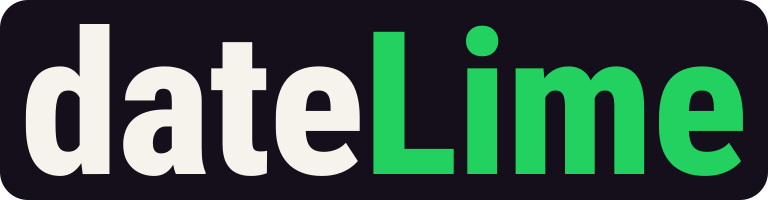
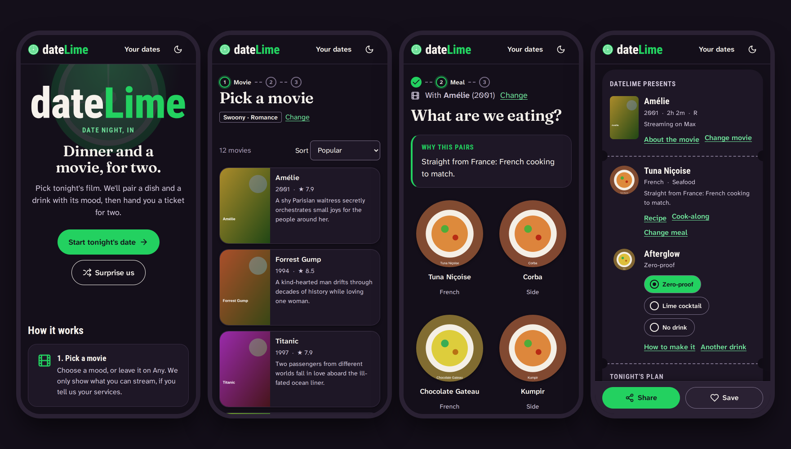

<p align="center"></p>

<p align="center"><strong>Dinner and a movie, for two.</strong><br>
Pick tonight's film. dateLime pairs a dish and a drink with its mood, then hands you a ticket for two.</p>

<p align="center"><a href="https://thisara-de.github.io/dateLime/"><strong>Open dateLime</strong></a> · <a href="docs/design/06-decision.md">Design spec</a> · <a href="docs/AUDIT.md">2022 code audit</a></p>



<sub>The landing page, results, recipes and the ticket in the dark "Late Show" theme. Screenshots use the test suite's mock data, so the posters and plates are placeholders, not real TMDB or TheMealDB images.</sub>

---

## How it works

Planning takes three steps, one decision each:

1. **Pick a movie.** Choose a mood (Swoony, Belly laughs, Rom-com, Edge of your seat, Scream together, Scary-funny, Tearjerker or Mind-bender), or leave it on Any. Optionally set a length or a rating cap. Results show only what's streaming on your services, if you've told us which ones.
2. **Pick a meal.** Recipes are matched to the movie, and a *Why this pairs* line says how: *"Straight from France: French cooking to match."* Turn off **Match the movie** to browse freely.
3. **Get your ticket.** An "Admit Two" ticket with the movie, the meal, a drink and tonight's timeline: start cooking, dinner, press play, credits. Save it, share it, or add it to your calendar.

Everything runs in the browser. There are no accounts, and your plans stay on your device.

## Features

| | |
|---|---|
| 🎟️ **The date ticket** | Save it (with undo) and share it as a link plus readable text, using the share sheet, the clipboard or a copyable field. Add a calendar invite with a 15-minute reminder. Set a cook-time estimate (30, 45, 60 or 90 min) for the timeline. When your date opens the link, they see the same ticket and can save it to their own dates. |
| 🍋 **Vibe pairing** | A movie's origin, its keywords or its genre decides the cuisine (see [below](#how-the-pairing-works)). Vegetarian, vegan and pescatarian diets are applied exactly, not guessed. The drink defaults to zero-proof; a lime cocktail or no drink are one tap away. |
| 🏠 **House rules** | Your streaming services and region (filtered in a single request), a rating cap, a diet, foods to avoid, a default drink and a theme. All of it is remembered on this device. |
| 💞 **Decide together** | A blind shortlist. Each of you hearts up to three movies without seeing the other's picks, then reveal: any overlap is *"It's a date!"*. *This feature is waiting on a hallway test with five couples before it's promoted from "should" to "must" (see the [design spec](docs/design/06-decision.md#architects-implementation-notes)).* |
| 🎰 **Spin the lime** | Can't decide? Three reels deal a movie, a dinner and a drink that follow your house rules. Hold any reel and spin again. |
| 👩‍🍳 **Cook-along** | One step at a time, in big type. Timers are found in the recipe text, with a chime, a vibration and an announcement. Also an ingredient checklist, a countdown to "press play", ← and → keys, and the screen stays awake while you cook. |
| 📔 **Your dates** | Upcoming and past dates. Rate past ones ("How was it?", 1 to 5 limes), and export or import your diary as JSON. |
| 🌗 **Two themes** | **Late Show** (dark) and **Matinee** (light), or **Auto**, which follows your system (and goes dark after 6 pm). |
| 📶 **Installable, works offline** | Add it to your home screen. After one visit the app opens without a connection, and recipes you've opened stay available. |

### How the pairing works

The recipe step picks cuisines from [TheMealDB](https://www.themealdb.com/) in three tiers, most specific first:

1. **Origin.** A film from France gets French cooking; one in Japanese gets Japanese. US films skip this tier, because "American" says little about a Hollywood film's mood, so their genre decides.
2. **Keywords.** TMDB keywords such as *paris*, *tokyo* or *road trip* name the cuisine outright. Occasions such as *christmas* or *wedding* add dessert.
3. **Genre.** Every TMDB genre has a pairing: crime gets red sauce and pasta, horror gets something fiery plus finger food you can eat without looking.

Diets are applied by intersecting the pairing with TheMealDB's vegetarian, vegan and seafood lists. If fewer than four recipes match, it keeps your diet, adds dishes from every cuisine, and says so. It never drops the diet. Foods to avoid (pork, beef, shellfish, nuts, dairy, mushrooms) are a best-effort scan of ingredient lists, and the page says so. It's never labeled "allergy-safe".

## What changed since 2022

The [audit](docs/AUDIT.md) found **44 defects** in the original code and reproduced 20 of them in a headless browser. Among them:

- Keyboard users couldn't get past step 1.
- A leftover debug call added 20 Fantasy movies to every result list.
- A click *anywhere* on the page navigated to the next step.
- "Save" saved nothing.
- The rating filter sent parameters TMDB ignores.
- White on `#23D160` measured 2.03:1 contrast.
- Every results page made 20 to 40 extra requests.
- Two billable RapidAPI keys were committed.

Every item is fixed in the rewrite, and [`tests/e2e/regressions.spec.js`](tests/e2e/regressions.spec.js) keeps one test per runtime defect. The paid Tasty API was replaced by the free TheMealDB, so no RapidAPI key is needed any more. The old page URLs (`movie.html`, `movielist.html?info=2,28` and so on) redirect to their new screens.

> **Maintainers:** the RapidAPI keys remain in the git history. If those accounts still exist, revoke the keys (see audit item 17).

## Architecture

A static single-page app built with native ES modules. There's no framework, no bundler and no build step: GitHub Pages serves the files exactly as they are in the repository.

- **Routing.** A hash router (`#/movies/results?mood=swoony`) loads each screen's module on demand. A view exports `title(ctx)` and `mount(outlet, ctx)`. Its `ctx.signal` aborts when you navigate away, so listeners and requests never leak between screens. Focus moves to the new page's heading.
- **Rendering.** `html` tagged templates escape every interpolated value by default. Third-party text can't inject markup, a class of bug the 2022 site had.
- **Security.** A strict Content-Security-Policy: `script-src 'self'` plus the hash of one inline theme script, `style-src 'self'`, and no inline event handlers.
- **Data.** The API clients normalize every response into plain objects. The HTTP layer adds timeouts, one retry on transient errors, de-duplicated in-flight requests and a session cache, and it redacts API keys from cache keys.
- **State.** A small versioned store in `localStorage` holds house rules, the plan in progress and saved dates, and it syncs across tabs. A shared ticket needs no storage at all: the URL *is* the plan.
- **Offline.** The service worker fetches app files network-first (with a timeout) and falls back to the cache, so you always get the latest deploy when online. Images are cache-first. API replies are network-first and cached.

```
index.html              App shell: header, <main>, footer, CSP, theme boot script
sw.js                   Service worker
manifest.webmanifest    Install metadata
movie.html … (5 files)  The 2022 page URLs, redirecting to their new routes
assets/
  css/                  tokens → base → components → views (cascade layers; both themes are tokens)
  fonts/                Self-hosted WOFF2 subsets and their licenses
  img/                  Logo, lime slice, app icons
  images/               The 2022 team's screenshot and wireframes
  js/
    main.js             Routes, header, theme controls, service worker registration
    config.js           API endpoints and keys (the only place they live)
    state.js            House rules, the plan in progress, saved dates
    ui.js               Shared UI: posters, plates, empty and error states, step indicator
    lib/                Router, HTML templates, HTTP client, store, theme, share, announcements
    api/                TMDB, TheMealDB and TheCocktailDB clients
    domain/             Pure logic: pairing, moods, plans, timeline, .ics, timers, foods to avoid
    components/         Wordmark, icons, bottom sheets, movie and recipe sheets
    views/              One module per screen
docs/                   The audit, the design record, screenshots
scripts/                Dev server, CSP hash sync, contrast report
tests/unit/             node --test
tests/e2e/              Playwright
```

## Development

You need Node.js 20 or newer. CI uses 22.

```sh
npm install
npx playwright install chromium   # first time only, for the browser tests
npm start                         # http://localhost:4173
```

| Command | What it does |
|---|---|
| `npm run lint` | ESLint |
| `npm run test:unit` | 91 unit tests: pairing, moods, plans, `.ics`, timers, API normalization, router, store, HTTP, theme, the service worker, CSP, and **every color pairing's contrast** in both themes |
| `npm run test:e2e` | 176 browser tests (88 scenarios on desktop Chrome and a Pixel 7) |
| `npm test` | Unit, then browser tests |
| `npm run check` | Lint and all tests, which is what CI runs on every push and pull request |

The browser tests mock every API ([`tests/e2e/support/mock-api.js`](tests/e2e/support/mock-api.js)), so they need no keys or network, and any console error fails the test. They cover:

- the full flow from mood to saved ticket, with request-level checks;
- every decided feature;
- one regression test per defect in the audit;
- axe-core WCAG 2.2 AA audits of every screen and open dialog, in both themes;
- reflow at 320px;
- reduced motion;
- layout invariants;
- a real offline run, where the test stops its own server.

After editing the inline theme script in `index.html`, run `node scripts/csp-hash.mjs` to update the CSP hash (a unit test catches a stale one). When you add a JavaScript or CSS file, add it to `PRECACHE` in `sw.js`; a unit test catches a missing one.

## Configuration

Every endpoint and key lives in [`assets/js/config.js`](assets/js/config.js).

- **TMDB:** dateLime is a static site, so its TMDB key is visible to anyone. It's a free, read-only v3 key. To use your own, create one at [themoviedb.org/settings/api](https://www.themoviedb.org/settings/api).
- **TheMealDB and TheCocktailDB:** these use the public test key `1`, which needs no sign-up. Check each service's terms before depending on it in production.

## Deployment

GitHub Pages serves the repository root. The empty `.nojekyll` file makes Pages serve the files as they are, and there's nothing to build. The service worker picks up new deploys on the next online visit.

## Accessibility

dateLime aims for **WCAG 2.2 AA**. In practice:

- Native form controls throughout, with visible 3px focus rings, a skip link, and one `h1` per screen that receives focus on navigation.
- Touch targets of at least 48px.
- Live announcements for results, timers and saves.
- Support for reduced motion, increased contrast and forced colors (Windows High Contrast).
- The layout reflows down to 320px.
- Color is never the only signal.

Automated checks run on every push but catch only some problems. If something doesn't work with your setup, please [open an issue](https://github.com/Thisara-DE/dateLime/issues).

## Privacy

There are no accounts, analytics or cookies. House rules, plans and saved dates stay in your browser's local storage. A shared link contains the plan and your optional note, so anyone with the link can read them. The landing page makes no third-party requests at all. Other screens call TMDB, TheMealDB and TheCocktailDB, and YouTube is contacted only if you press play on a trailer (using youtube-nocookie.com).

## Credits

- Movie data from [TMDB](https://www.themoviedb.org/). *This product uses the TMDB API but is not endorsed or certified by TMDB.*
- Streaming availability by [JustWatch](https://www.justwatch.com/), via TMDB.
- Recipes from [TheMealDB](https://www.themealdb.com/), drinks from [TheCocktailDB](https://www.thecocktaildb.com/).
- Fonts: [Fraunces](https://github.com/undercasetype/Fraunces), [Roboto Condensed](https://fonts.google.com/specimen/Roboto+Condensed) and [Atkinson Hyperlegible Next](https://github.com/googlefonts/atkinson-hyperlegible-next), all under the SIL Open Font License 1.1 (licenses in [`assets/fonts/`](assets/fonts/)).
- Icons adapted from [Lucide](https://lucide.dev) (ISC License).

## The team

dateLime began in 2022 as a group project by:

- **Cha Vue** – [@chavue91](https://github.com/chavue91)
- **Ryan Harris** – [@rharris529](https://github.com/rharris529)
- **Sonja Watson** – [@Sonarie](https://github.com/Sonarie)
- **Thisara M A** – [@Thisara-DE](https://github.com/Thisara-DE)
- **Will Yazdani** – [@WillYazdani](https://github.com/WillYazdani)

It was remastered in 2026.

## License

This project is open source and available to the community. The fonts and icons keep their own licenses, listed above.

## Contributing

Interested in improving dateLime? We'd love to see your contributions! Fork the repository and open a pull request. CI runs the linter and every test on it.
